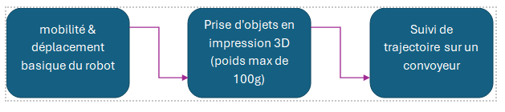

Le cahier des charges a été le temps pour nous de réfléchir à nos besoins pour ce robot, quels seraient ses buts, notre organisation durant ce projet. Puis, nos objectifs principaux autant personnels que professionnels, nous ont amené à construire un cahier des charges réalisables sur notre temps imparti.  

Tout au long de ce projet, l’application Trello fut notre guide pour respecter le temps imparti, nos objectifs de projet et nos attentes.  

 

## 1 - Contexte du projet :  

 

Au cours de notre quatrième année au sein d’UniLaSalle Amiens, nous avons eu l’opportunité de participer aux cours de projet. Ces cours ont pour but de nous apprendre de nouvelles compétences via un projet en groupe de 72 heures. La liberté de création de projet nous a permis de réaliser un robot capable de prendre des pièces en mouvement sur un convoyeur. Actuellement, au sein de l’école nous avons la chance d’avoir l’usine école, regroupant différents robots avec des compétences larges. Cependant, il n’y a pas de robot suivi de trajectoire. C’est pour cela, que ce projet nous tient à cœur : il pourrait permettre aux étudiants de pratiquer dans l’usine école du suivi de trajectoire.  

 

## 2 - Objectifs principaux du projet :  

L’objectif premier est de créer un robot étant capable de faire du suivi de trajectoire au sein de l’usine école, afin de l’intégrer dans les TP des étudiants. 

Cet objectif s’articule autour d’autres points tels que :  

<ul>
<li>
<strong>Création d’un bras robotisé à 6 axes fonctionnel :</strong> Le robot devra être capable de réaliser des mouvements précis dans l’espace. 
</li>
<li>
<strong>Contrôle logiciel :</strong> Le robot devra être connecté à une interface logicielle qui offrira aux utilisateurs la possibilité de le programmer, de configurer des séquences de mouvements, et d’ajuster des paramètres pour des expériences variées. 
</li>
<li>
<strong>Mobilité :</strong> Le bras robotisé doit être transportable, compact et léger afin de pouvoir être utilisé dans différents environnements d’apprentissage. (Démontable) 
</li>
</ul>
 

Les buts de ce robot sont aussi séquencés. En effet, nous avons commencé par de petits buts tels que le faire bouger, puis, nous avons compliqué avec des buts précis : pouvoir le contrôler via un logiciel ou une tablette, rendant ainsi, l’utilisation plus optimale.  

Sur ce schéma, le résumé de nos buts durant ce projet :   

## 3 - Différents domaines de travail du robot PAJET :  

 
<ul>
<li>
<strong>Aspect mécanique du robot :</strong> physique et 3D 
</li>
<li>
<strong>Aspect mécanique du robot :</strong> calcul 
</li>
<li>
<strong>Contrôle des moteurs :</strong> FB5116M et FT1025M 
</li>
<li>
<strong>Développement du contrôle :</strong> gérer les déplacements, combiner les mouvements avec la vision  
</li>
<li>
<strong>Caméra :</strong> gestion de la vision 
</li>
</ul>
 

## 4 - Exigences techniques :  

Pour assurer le respect des objectifs pédagogiques et fonctionnels, le robot devra : 
<ul>
<li>
<strong>Posséder une structure mécanique robuste et légère :</strong> La structure doit être conçue avec des matériaux à la fois solides et légers pour assurer la durabilité tout en restant transportable. 
</li>
<li>
<strong>Intégrer un système de vision :</strong> Le robot pourrait être équipé d’une caméra et de capteurs pour reconnaître et manipuler des objets dans son environnement. 
</li>
</ul>

## 5 - Contraintes et recommandations :  
<ul>
<li>
<strong>Respect des normes de sécurité :</strong> La conception du robot doit inclure des éléments de sécurité pour protéger les utilisateurs.
</li> 
<li>
<strong>Documentation complète :</strong> Le projet devra inclure une documentation technique. 
</li>
</ul>