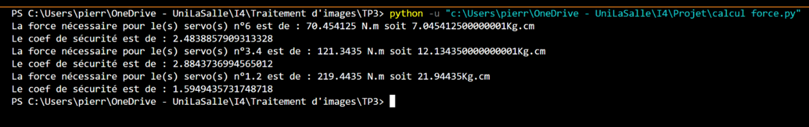

Nous avons commencé par estimer le couple nécessaire avant la conception totale : (préciser que c’est un choix de début, remettre à la fin de poids réel) 

<ul>
<li>Au départ de l’axe n°2 : 16,6kg/cm -> 33,2kg/cm (avec coef de sécurité de 2)</li>  

<li>Au départ de l’axe n°3 : 15,5,75kg/cm - >31,5kg/cm (avec coef de sécurité de 2)</li>  

<li>Au départ de l’axe n°5 : 3,3kgkg/cm - >6,6kg/cm (avec coef de sécurité de 2)</li>  
</ul>

Vitesse linéaire maximal du bras :   

 

        0,2sec/60° -> 1,2sec/360°   

        1,2 * 2 * pi = 7,54 rad/s   

        7,54 * 60 = 452 cm/s -> 4,52 m/s à vide bras déployé   

        7,54 * 20 = 150,8cm/s -> 1,58 ms/s à vide bras mi-déployé   

Il est également nécessaire de connaître la position du moteur pour déterminer si le bras fonctionne correctement.    

Grace à cela, nous avons pu sélectionner plusieurs moteurs compatibles : 

| Type | Référence | Couple | Prix |
| :-:  |   :-:     | :-:    |  :-: |
| Servomoteurs avec feedback | GoTronic | 17.5 kg/cm | 14.65 x 8 = 117.2€  |
| Moteurs pas à pas avec encodeurs | 17HS19-2004S1  | 5.9kg/cm  | 19.50 x 8 = 156€  |
| Moteurs pas à pas avec encodeurs | 23HS30-2804S   | 18.9kg/cm  | 39.9 x 8 = 319€   |
| Moteurs pas à pas avec réducteurs | 42STH38-100   | 48kg/cm  | 68.9 x 8 = 551.2€   |
| Servomoteurs digital feetech |   |  | 13.50 x 2 = 27€    |

L’utilisation d’un moteur pas à pas nous oblige à ajouter un encodeur à l’arrière de celui-ci pour connaître sa position. Cela aura pour conséquence d’en augmenter le coût.  

De plus, il faut également acheter un driver par moteur pour les contrôler, ce qui représente un coût supplémentaire (environ 15 € par moteur).   

   

Dans cette optique de réduction des coûts, il est donc préférable d'utiliser des servos moteurs, bien moins chers, plus simples à mettre en place, moins lourds et plus petits.
